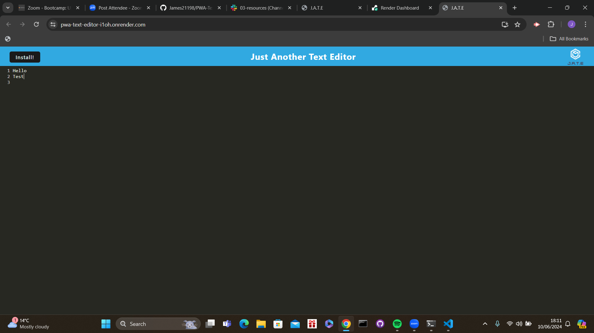

# PWA-Text-Editor

## What was my objective and what have i accomplished?
In this project i was tasked with creating a fully functioning Text Editor using progressive web applications which i have successfully been able to accomplish by making it possible for the user to add and update text. I was also tasked with ensuring that when the user runs "npm run start" that the application then starts up the backend and serves the client which I have also successfully done.

In addition i was also tasked with ensuring that a service worker and a database was set up when this application is run which I have successfully done by ensuring that when it runs the user is able to save data to a cache which can then be called back when the application is reloaded.

The user should also be able to install the application to their device which i have successfully done by ensuring that when the user clicks the install button the application is then installed and can be open at will. Finally i was also tasked with making sure that when the user runs the webpack plugins that a HTML, Service worker and Manifest File which I have also been able to accomplish

https://pwa-text-editor-i1oh.onrender.com/
